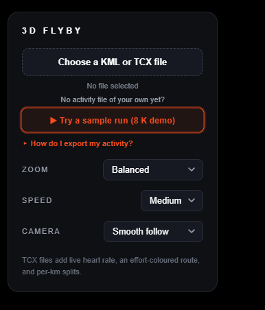
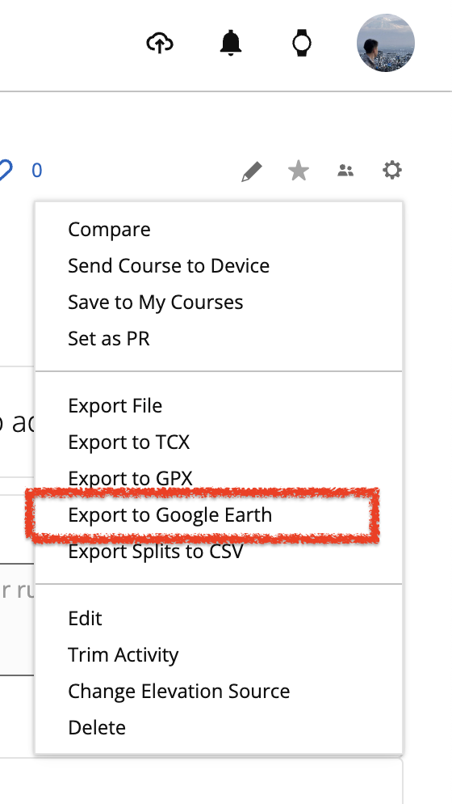

# kml-3d-flyby

> Turn any Garmin KML or TCX activity into a cinematic 3D flyby MP4 — duration scales with route length, Strava-style. TCX adds a live heart-rate readout.


MapLibre GL (no API key) + Playwright + ffmpeg. Satellite tiles, banking
camera, Strava-orange glow, distance / pace / elapsed overlays, end card.

## Quickstart

```sh
npm install
npx playwright install chromium
node render.js kml/activity_22906933937.kml   # or a .tcx file
```

Output: `out/<name>.mp4` at 1080×1920 portrait / 30fps. Length is computed
from route distance (~25 s for a quick 2 km loop, ~45 s for a 10 K,
~2 min for a marathon — see [Duration scaling](#duration-scaling)).

## Live preview in a browser

**Hosted:** <https://nicksonthc.github.io/kml-3d-flyby/> — no install, just drop a KML.

Or run locally:

```sh
open flyby.html
```

Pick a Garmin-exported KML or TCX in the file input — the flyby plays live, no
ffmpeg needed. The format is auto-detected; TCX files also show a live
heart-rate readout (beside the pace), an **effort-coloured route** (cool = easy,
hot = hard — which also tells out-and-back passes apart), an avg/max BPM line on
the end card, and a per-km splits scene (pace + heart rate bars) after the flyby.

No export of your own yet? Hit **Try a sample run** under the file picker to load
a bundled ~8 K Garmin TCX and see everything in action. The panel also has a
**How do I export my activity?** hint with steps for Garmin Connect, Strava,
Coros, Polar, and Suunto.

### Record an MP4 right in the browser

Once a route is loaded, a **Record MP4** button appears (top-right). It composites
the map + HUD onto a hidden 1080×1920 canvas and pipes `captureStream()` into
`MediaRecorder` at 30 fps / 12 Mbps — no tab-capture popup, no WebGL freeze. The
flyby plays once, the end card holds for a beat, then the file downloads
automatically. Output is `.mp4` (H.264) where the browser supports it (Chrome,
Safari) and falls back to `.webm` (VP9) elsewhere — remux losslessly with
`ffmpeg -i in.webm -c copy out.mp4`, or use `render.js` for guaranteed H.264.

### Controls

The setup panel has three dropdowns (each with a sensible default):

| Control | Options | Default | What it does |
|---|---|---|---|
| **Zoom** | Extreme close-up · Very close-up · Close-up · Balanced · Wide · Bird's-eye | Balanced | How tight the camera frames the route (Extreme ≈ rooftop level, Bird's-eye ≈ city-block view) |
| **Speed** | Slow · Medium · Fast | Medium | Playback length (Slow ≈ 1.7×, so the distance counts up gently) |
| **Camera** | Smooth follow · Cinematic · Steady · north-up | Smooth follow | Smooth = calm follow (locked on straights, turns capped at 22°/s); Cinematic = dynamic banking; Steady = north-up, no rotation |

Zoom and Camera update the running flyby live; Speed applies on the next play.
The same values can be passed to `render.js` (or any URL) as query params, e.g.
`flyby.html?render=1&zoom=wide&speed=slow&camera=steady`.



## Export an activity from your watch

Both **KML** and **TCX** drop straight into the picker (or pass to `render.js`);
TCX is the richer format — it carries per-point heart rate, so prefer it when
your platform offers it.

- **Garmin Connect** — open an activity → ⚙ gear icon → **Export to Google
  Earth** (`.kml`) or **Export to TCX** (`.tcx`).
  [connect.garmin.com](https://connect.garmin.com/)
- **Strava** — open an activity → ⋯ menu → **Export GPX**, then convert to
  KML/TCX (native GPX import is on the [roadmap](#roadmap)).
- **Coros / Polar / Suunto** — export the activity as **TCX** from the web
  dashboard.

The in-app **How do I export my activity?** hint mirrors these steps.



## How it works

- KML `<LineString>` → `[lon, lat]` array; cumulative distances via haversine.
- MapLibre renders ESRI World Imagery satellite tiles.
- A glowing line layer progressively reveals along the route.
- Camera tracks position at pitch 60°, bearing = chord direction
  (50 m behind → 150 m ahead), eased with a ~1.5 s time constant for a
  smooth pan without vertigo.
- Camera zoom holds the chosen **Zoom** preset's `fly` level during the flight
  (Balanced ≈ 16.4), then eases out to its wider `end` level (≈ 14.6) over the
  final ~18 % of the timeline (`ZOOM_OUT_START = 0.82`) so the full route is
  visible before the end card. Six presets span rooftop-tight (Extreme) to a
  city-block view (Bird's-eye).
- Overlay shows distance / pace / elapsed / lap chip, end card fades in.
- **TCX end sequence:** after the flyby, the summary end card holds for a beat,
  then cross-fades up into a **per-km splits scene** — one bar per kilometre
  (length ∝ speed, fastest km highlighted), its pace, and avg HR with a heart.
  Bars sweep in staggered with an `expoOut` settle, then the frame holds. The
  splits come from the TCX laps' *moving* time + per-lap avg/max HR (Garmin
  auto-laps every km), so paused time doesn't skew the pace.
- `?render=1` swaps wall-clock animation for deterministic
  `window.renderFrame(t)` calls driven by Playwright; ffmpeg encodes the
  PNG stream into MP4.

## Duration scaling

Fixed-length flybys feel rushed for a marathon and dragged-out for a
parkrun, so duration scales with the activity's distance — same idea
Strava uses for its 3D Flyover. The formula (top of `flyby.html`):

```
duration_s = clamp(20 + km × 2.5, 25, 150)
```

| Distance | Flyby length |
|---:|---:|
| 2 km   | 25 s (min) |
| 5 km   | 32.5 s |
| 10 km  | 45 s |
| 21 km  | 72.5 s |
| 42 km  | 125 s |
| 60+ km | 150 s (max) |

`flyby.html` recomputes this each time a KML loads and exposes it as
`window.flybyDurationS`; `render.js` reads it back to size the MP4 frame
count, so live preview and exported video stay in sync.

## Tweak

| Knob | File | Default |
|---|---|---|
| Duration curve | `flyby.html` `DURATION_BASE_S` / `DURATION_PER_KM_S` | 20 s + 2.5 s/km |
| Duration clamp | `flyby.html` `DURATION_MIN_S` / `DURATION_MAX_S` | 25 s / 150 s |
| Route color | `flyby.html` `ROUTE_COLOR` | `#FC4C02` |
| Pitch | `flyby.html` `PITCH` | 60° |
| Zoom presets | `flyby.html` `ZOOM_PRESETS` | balanced 16.4 / 14.6 |
| Speed presets | `flyby.html` `SPEED_PRESETS` | medium 1.25× |
| Camera presets (`deadband`°, `maxRate` °/s, `tau`) | `flyby.html` `CAMERA_PRESETS` | smooth: lock <11°, ≤22°/s |
| Pull-back start | `flyby.html` `ZOOM_OUT_START` | 0.82 (82 % through) |
| Default settings | `flyby.html` `CFG_DEFAULTS` | balanced / medium / smooth |
| Summary hold (TCX) | `flyby.html` `END_HOLD_S` | 2.4 s |
| Splits scene length | `flyby.html` `computeSplitsS()` / `SPLITS_*_S` | clamp(3 + 0.55·n, 5, 16) s |
| Output FPS / size | `render.js` `FPS` / `WIDTH` / `HEIGHT` | 30 / 1080 / 1920 |

## Input formats

The loader sniffs the file and picks a parser — no need to say which is which.

- **KML** — reads the first `Placemark > LineString > coordinates` plus the
  optional `Folder > name`, start description (date / total time / official
  distance), and `Lap N` placemarks for pace.
- **TCX** — reads every `Trackpoint` (position + heart rate), the `Lap`
  summaries (time / distance for pace + totals), and the `Activity` sport /
  start time for the title and date. Because each point carries a BPM, TCX
  drives the live heart-rate readout and the end-card avg/max HR.

## Roadmap

- [x] **TCX import** — Garmin's training-centric format (laps, HR, cadence).
- [x] **Auto-detect format** — sniff the file and pick the right parser.
- [ ] **GPX import** — Garmin / Strava / most watches' default export.
- [ ] **FIT import** — Garmin's native binary format (richest data, smallest file).
- [ ] **Cadence / power readouts** — TCX also carries `RunCadence` and `Watts`.

PRs welcome. Each new parser only needs to return the same shape as
`parseKml()` / `parseTcx()` in `flyby.html` (coords array + optional total
time, distance, laps, name, date, and an optional per-point `hr` array) —
the renderer downstream is format-agnostic.

## License

MIT — see [LICENSE](LICENSE).
